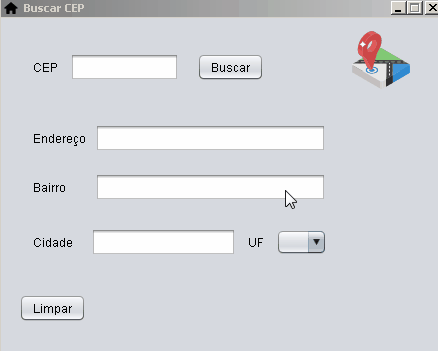

# BuscaCEP utilizando Web Service

 O Projeto consiste em criar uma aplicação que faz uma busca do CEP utilizando WebService. Pode ser usada nas compras online em lojas virtuais, cadastro de cliente, fornecedores, entre outros. 

<h1>Tecnologias</h1>

<ul>
  <li>biblioteca atxy2k (utilizado para fazer a validação do CEP)</li>
  <li>framework dom4j (utilizado para extrair informações de um documento XML)</li>
  <li>framework Java Swing</li>
  <li>WebService https://www.republicavirtual.com.br/</li>
<ul/>
